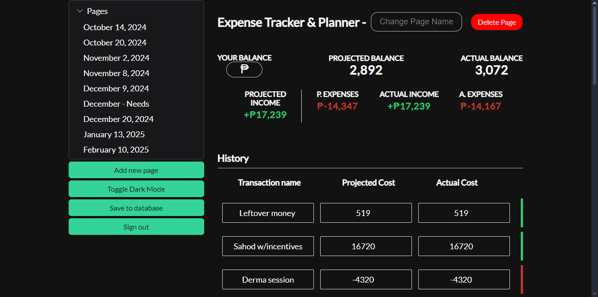

# Expense Tracker and Planner



## Live Link: 
[Click me!](https://vue---expense-tracker.web.app)

## Overview
The **Expense Tracker and Planner** is a web application built with Vue.js that helps users manage their expenses and plan their finances effectively. It provides a user-friendly interface for tracking spending, creating budgets, and analyzing financial habits.

## Features
- **User Authentication**: Secure login and registration using Firebase.
- **Expense Management**: Add, edit, and delete expenses easily.
- **Data Storage**: User data is securely stored using Firebase Realtime Database.
- **Responsive Design**: A modern UI built with PrimeVue components for a seamless experience.

## Problems Addressed
This application aims to solve common financial management issues, including:
- Difficulty in tracking daily expenses.
- Cannot see **ACTUAL BALANCE** vs **PROJECTED/PLANNED BALANCE (after all the spending)**
- Lack of budgeting tools for effective financial planning.
- Inadequate insights into spending habits.

## Installation
1. Clone the repository:
   ```bash
   git clone <repository-url>
   cd expense-tracker-and-planner
    ``` 

2. Install dependencies:
    ```bash
    npm install
    ```

3. Run the application in development mode:
    ```bash
    npm run dev
    ```

## Usage
- Access the application in your browser at http://localhost:3000.
- Create an account or log in to start tracking your expenses.

## Contributing
Contributions are welcome! Please open an issue or submit a pull request.

License
This project is licensed under the MIT License.